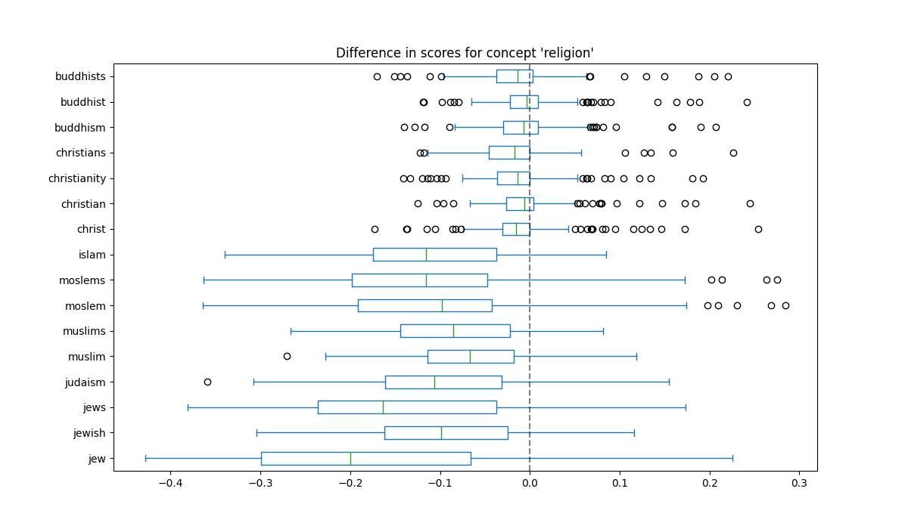

# biaslyze
The NLP Bias Identification Toolkit


## Usage example

```python
from biaslyze.bias_detectors import CounterfactualBiasDetector

bias_detector = CounterfactualBiasDetector()

# detect bias in the model based on the given texts
# here, clf is a scikit-learn text classification pipeline trained for a binary classification task
detection_res = bias_detector.process(
    texts=texts,
    predict_func=clf.predict_proba
)

# see a summary of the detection
detection_res.report()

# visualize the counterfactual scores
detection_res.visualize_counterfactual_scores()
```

Example output:



## Development setup

- First you need to install poetry to manage your python environment: https://python-poetry.org/docs/#installation
- Run `make install` to install the dependencies and get the spacy basemodels.
- Now you can use `biaslyze` in your jupyter notebooks.


### Adding concepts and keywords

You can add concepts and new keywords for existing concepts by editing [concepts.py](https://github.com/biaslyze-dev/biaslyze/blob/keyword-based-targeted-lime/biaslyze/concepts.py).

## Preview/build the documentation with mkdocs

To preview the documentation run `make doc-preview`. This will launch a preview of the documentation on `http://127.0.0.1:8000/`.
To build the documentation html run `make doc`.

## Style guide

We are using isort and black: `make style`
For linting we are running ruff: `make lint`

## Contributing

Follow the google style guide for python: https://google.github.io/styleguide/pyguide.html

This project uses black, isort and ruff to enforce style. Apply it by running `make style` and `make lint`.

