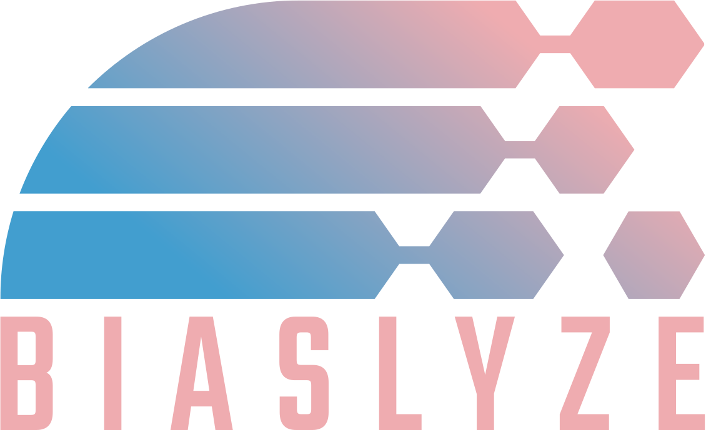
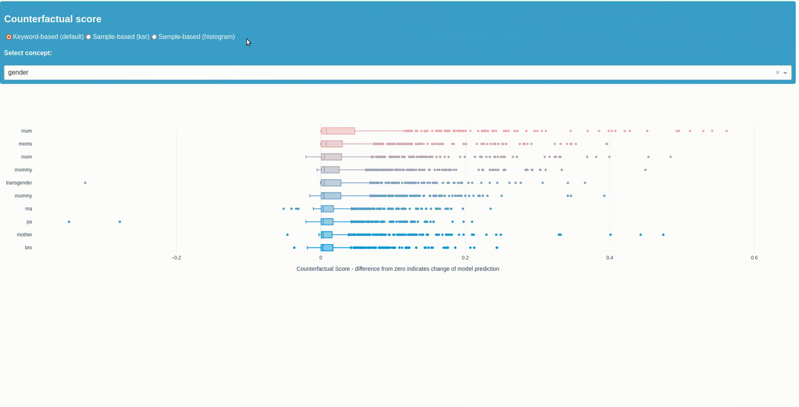

<div align="center">
  
  <h1>The NLP Bias Identification Toolkit</h1>
</div>

<div align="center">
    <a href="https://github.com/biaslyze-dev/biaslyze/blob/main/LICENSE">
        
    </a>
    <a href="https://pypi.org/project/biaslyze/">
        
    </a>
    <a href="https://pypi.org/project/biaslyze/">
        
    </a>
    <a href="#">
        
    </a>
</div>


Bias is often subtle and difficult to detect in NLP models, as the protected attributes are less obvious and can take many forms in language (e.g. proxies, double meanings, ambiguities etc.). Therefore, technical bias testing is a key step in avoiding algorithmically mediated discrimination. However, it is currently conducted too rarely due to the effort involved, missing resources or lack of awareness for the problem.

Biaslyze helps to get started with the analysis of bias within NLP models and offers a concrete entry point for further impact assessments and mitigation measures. Especially for developers, researchers and teams with limited resources, our toolbox offers a low-effort approach to bias testing in NLP use cases.


## Installation

Installation can be done using pypi:
```bash
pip install biaslyze
```

Then you need to download the required spacy models:
```bash
python -m spacy download en_core_web_sm
```

## Quickstart

```python
from biaslyze.bias_detectors import CounterfactualBiasDetector

bias_detector = CounterfactualBiasDetector()

# detect bias in the model based on the given texts
# here, clf is a scikit-learn text classification pipeline trained for a binary classification task
detection_res = bias_detector.process(
    texts=texts,
    predict_func=clf.predict_proba
)

# see a summary of the detection
detection_res.report()

# launch the dashboard visualize the counterfactual scores
detection_res.dashboard(num_keywords=10)
```

You will get results as Boxplots, among others, indicating the impact of keywords and concepts on the prediction of your model.
Example output:



See more detailed examples in the [tutorial](https://biaslyze.org/tutorials/tutorial-toxic-comments/).

## Supported Models

All text classification models with probability output are supported. This includes models from scikit-learn, tensorflow, pytorch, huggingface transformers and custom models. The bias detection requires you to pass a `predict_proba` function similar to what you would get on scikit-learn models. You can find a tutorial on how to do that for pre-trained transformer models [here](https://biaslyze.org/tutorials/tutorial-hugging-hatexplain/). 

## Scientific Background

The bias detection and mitigation methods are based on the following papers:

- Garg, Sahaj, et al. **"Counterfactual fairness in text classification through robustness."** [Proceedings of the 2019 AAAI/ACM Conference on AI, Ethics, and Society. 2019](https://arxiv.org/abs/1809.10610).
- Prabhakaran, Vinodkumar, Ben Hutchinson, and Margaret Mitchell. **"Perturbation sensitivity analysis to detect unintended model biases."** [arXiv preprint arXiv:1910.04210 (2019)](https://arxiv.org/abs/1910.04210).

## Development setup

- First you need to install poetry to manage your python environment: https://python-poetry.org/docs/#installation
- Run `make install` to install the dependencies and get the spacy basemodels.
- Now you can use `biaslyze` in your jupyter notebooks.


### Adding concepts and keywords

You can add concepts and new keywords for existing concepts by editing the concept files in [concepts](https://github.com/biaslyze-dev/biaslyze/blob/main/biaslyze/concepts/).
A tutorial on how to create custom concepts and work with them can be found [here](https://biaslyze.org/tutorials/tutorial-working-with-custom-concepts/).

## Preview/build the documentation with mkdocs

To preview the documentation run `make doc-preview`. This will launch a preview of the documentation on `http://127.0.0.1:8000/`.
To build the documentation html run `make doc`.


## Run the automated tests

`make test`


## Style guide

We are using isort and black: `make style`
For linting we are running ruff: `make lint`

## Contributing

Follow the Google style guide for Python: https://google.github.io/styleguide/pyguide.html

This project uses black, isort and ruff to enforce style. Apply it by running `make style` and `make lint`.

## Acknowledgements

* Funded from March 2023 until August 2023 by 
