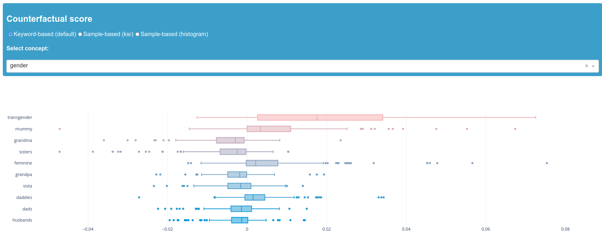
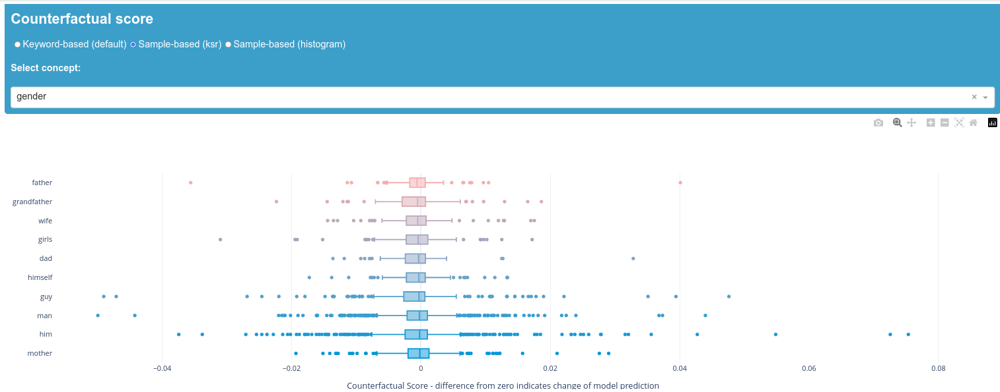
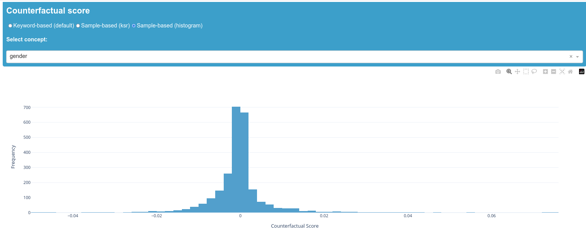

# How to use biaslyze to test pretrained hate speech detection models
Data source for training: 
[https://www.kaggle.com/c/jigsaw-toxic-comment-classification-challenge](https://www.kaggle.com/c/jigsaw-toxic-comment-classification-challenge)

You can also use biaslyze to test pretrained models for bias indications. This notebook will show you how using a hate speech classifier model from hugging face.


# Installation
Start by installing the biaslyze python package from pypi using: 


```python
!pip install biaslyze
```

```python
import numpy as np
import pandas as pd
from sklearn.feature_extraction.text import TfidfVectorizer
from sklearn.linear_model import LogisticRegression
from sklearn.pipeline import make_pipeline
from sklearn.metrics import accuracy_score
```

## Load and prepare data


```python
df = pd.read_csv("../data/toxic-comments/train.csv"); df.head()
```


<div>
<style scoped>
    .dataframe tbody tr th:only-of-type {
        vertical-align: middle;
    }

    .dataframe tbody tr th {
        vertical-align: top;
    }

    .dataframe thead th {
        text-align: right;
    }
</style>
<table border="1" class="dataframe">
  <thead>
    <tr style="text-align: right;">
      <th></th>
      <th>id</th>
      <th>comment_text</th>
      <th>toxic</th>
      <th>severe_toxic</th>
      <th>obscene</th>
      <th>threat</th>
      <th>insult</th>
      <th>identity_hate</th>
    </tr>
  </thead>
  <tbody>
    <tr>
      <th>0</th>
      <td>0000997932d777bf</td>
      <td>Explanation\nWhy the edits made under my usern...</td>
      <td>0</td>
      <td>0</td>
      <td>0</td>
      <td>0</td>
      <td>0</td>
      <td>0</td>
    </tr>
    <tr>
      <th>1</th>
      <td>000103f0d9cfb60f</td>
      <td>D'aww! He matches this background colour I'm s...</td>
      <td>0</td>
      <td>0</td>
      <td>0</td>
      <td>0</td>
      <td>0</td>
      <td>0</td>
    </tr>
    <tr>
      <th>2</th>
      <td>000113f07ec002fd</td>
      <td>Hey man, I'm really not trying to edit war. It...</td>
      <td>0</td>
      <td>0</td>
      <td>0</td>
      <td>0</td>
      <td>0</td>
      <td>0</td>
    </tr>
    <tr>
      <th>3</th>
      <td>0001b41b1c6bb37e</td>
      <td>"\nMore\nI can't make any real suggestions on ...</td>
      <td>0</td>
      <td>0</td>
      <td>0</td>
      <td>0</td>
      <td>0</td>
      <td>0</td>
    </tr>
    <tr>
      <th>4</th>
      <td>0001d958c54c6e35</td>
      <td>You, sir, are my hero. Any chance you remember...</td>
      <td>0</td>
      <td>0</td>
      <td>0</td>
      <td>0</td>
      <td>0</td>
      <td>0</td>
    </tr>
  </tbody>
</table>
</div>


## Test a pretrained hate speech detection model

Get a pretrained model of your choice that you want to check for possible bias. In this case we will test Hugging Face's HateXplain model. This binary model classifies text as "Abusive" (Hatespeech and Offensive) or "Normal" text.

model source: [https://huggingface.co/Hate-speech-CNERG/bert-base-uncased-hatexplain-rationale-two](https://huggingface.co/Hate-speech-CNERG/bert-base-uncased-hatexplain-rationale-two)

repo: [https://github.com/hate-alert/HateXplain](https://github.com/hate-alert/HateXplain)


```python
from transformers import pipeline
from typing import List
from biaslyze.bias_detectors import CounterfactualBiasDetector
```


The given classification model works with labels and scores but since we want to assess the variance between the predicted probability scores of the counterfactual text and the original text we need to translate the models results into a matrix first.


```python
class HateSpeechClf:
    
    def __init__(self):
        self._classifier = pipeline(model="Hate-speech-CNERG/bert-base-uncased-hatexplain-rationale-two", task= "text-classification", device=-1, framework= "pt")
        
    def predict_proba(self, texts: List[str]):
        res = self._classifier(texts, top_k=None, truncation=True, batch_size=4)
        return np.array([np.array([d[0]["score"], d[1]["score"]]) for d in res])
```


```python
hate_clf = HateSpeechClf()
```


Now we can check the model for bias indications within the relevant concepts provided by biaslyze. If you want to work with your own concepts or add to the given ones, please check out the tutorial on [how to use custom concepts](../../tutorials/tutorial-working-with-custom-concepts/). 


```python
bias_detector = CounterfactualBiasDetector()
```

```python
counterfactual_detection_results = bias_detector.process(
    texts=df.comment_text.sample(10000),
    predict_func=hate_clf.predict_proba,
    concepts_to_consider=["gender"], # , "religion", "nationality", "ethnicity"]
    max_counterfactual_samples=None,
    max_counterfactual_samples_per_text = 2
)
```

    2023-08-11 10:51:49.666 | INFO     | biaslyze.concept_detectors:detect:35 - Started keyword-based concept detection on 10000 texts...
    100%|███████████████████████████████████████████████████████████████████| 10000/10000 [00:00<00:00, 10160.91it/s]
    2023-08-11 10:51:50.653 | INFO     | biaslyze.concept_detectors:detect:51 - Done. Found 8990 texts with protected concepts.
    2023-08-11 10:51:50.654 | INFO     | biaslyze.bias_detectors.counterfactual_biasdetector:process:137 - Processing concept gender...
    100%|███████████████████████████████████████████████████████████████████████| 8990/8990 [00:32<00:00, 276.02it/s]
    100%|██████████████████████████████████████████████████████████████████████| 8990/8990 [00:05<00:00, 1795.13it/s]
    2023-08-11 10:52:28.236 | INFO     | biaslyze.bias_detectors.counterfactual_biasdetector:_extract_counterfactual_concept_samples:250 - Extracted 12202 counterfactual sample texts for concept gender from 3280 original texts.
    100%|█████████████████████████████████████████████████████████████████████████| 81/81 [2:30:22<00:00, 111.39s/it]
    2023-08-11 13:22:50.903 | INFO     | biaslyze.bias_detectors.counterfactual_biasdetector:process:197 - DONE


## Looking at the results 

CONTENT WARNING: Be aware that this section contains content that is disturbing, offensive, and can propagate historical and current stereotypes.

The keyword-based scores show relatively low deviation from our zero value, which indicates that the individual keywords do not have a lot of impact on the prediction of the model. "Transgender" is the only exception here. It is therefore advisable to take a look at the corresponding samples and the ksr-score in order to understand how this outlier is caused. We can see that "transgender" does not appear among the top 50 scores of the ksr-scores, which could indicate a representation problem causing this keyword to perform differently. It is possible that the keyword does not appear in the dictionary.

Overall, there is no clear evidence that a keyword or concept impacts the prediction of the model strongly and that there is a corresponding bias. 
However, it is important to note that a full assessment of whether the model is biased is highly dependent on the application context which must always be taken into account when interpreting the results.


```python
counterfactual_detection_results.dashboard(num_keywords = 10)
```




